# Git-Playground

An open repository for playing around with Git commands.

## Notes
- The "main" branch is **protected**: All commits must be made to a non-protected branch and submitted via a pull request (PR) before they can be merged into the "main" branch.
- 1 reviewer is required to merge a PR into the main branch.   
- This repo is connected to our [firmware Jira project](https://ubcformulaelectric.atlassian.net/jira/software/c/projects/FW/boards/7?atlOrigin=eyJpIjoiYTNlZWQzMjY5MjRlNDEyNmI2MTA4ZDkyMmNhZGZkMjkiLCJwIjoiaiJ9) using the [GitHub for Jira](https://ubcformulaelectric.atlassian.net/jira/marketplace/discover/app/com.github.integration.production) app. Feel free to play around by creating an "example" issue and linking it to a Git branches and commit. Don't forget to delete the "example" issue after.

## Git + Jira Issue Lifecycle Demo

Prereqs: Access to to the Jira firmware project and a local copy of the Git-Playground repo.

1. Create a Jira issue and place it in the Selected For Development status. I've created a task to "Implement traction control" under the "[ECU] DCM" epic. 

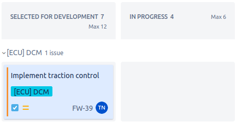

2. Locate the issue key for the Jira issue that you've created. In my case, it's “FW-39”. 

3. Create and checkout a new local Git branch to associate with your issue by entering `git checkout -b <issue key>-<relevant name>` from your terminal. Don't forget the dash between the issue key and the relevant name. I decided to name my local branch "FW-39-DCM-Implement-Traction-Control". 

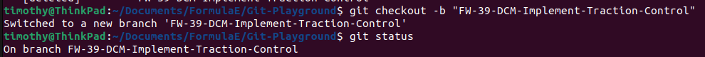

4. Create the upstream branch on GitHub for your local branch by entering `git push -u origin <branch name>`.

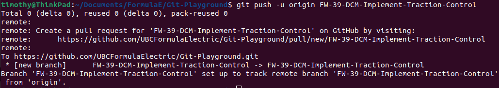

5. If you go back to  Jira's board view, you should notice that the issue's status transitioned automatically from "Selected For Development" to "In Progress". You should also see a comment in the activity section confirming this status transition.

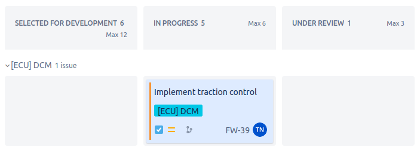
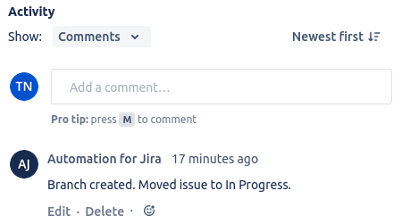

> You must push your local branch or commit to GitHub for Jira to update.

6. Confirm that you can access the dev view by pressing the branch icon in the issue card and selecting "View all development information". You can also access the dev view from the "Development" field in the issue details.

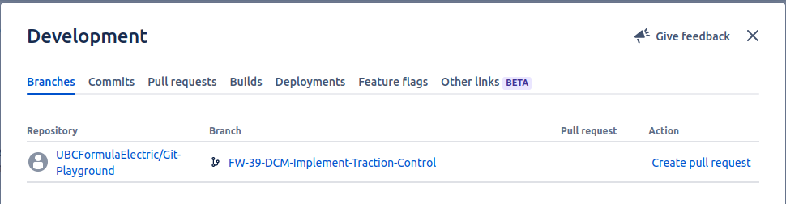

7. Make a change in your working copy, e.g. create a random text file, and add it to the staging area by entering `git add .`(this command actually adds everything to the staging area, which is OK since we've only modified one item).

8. Commit your change by entering `git commit -m "<Issue key> <Commit description>"`. Jira will only recognize your commit if you have the issue key in your commit message.

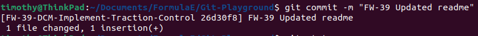

9. Push your commit by entering `git push`.

10. Verify in Jira that you've created 1 branch and 1 commit in the Development issue field. You should also see details of about the commit if you access the development view.

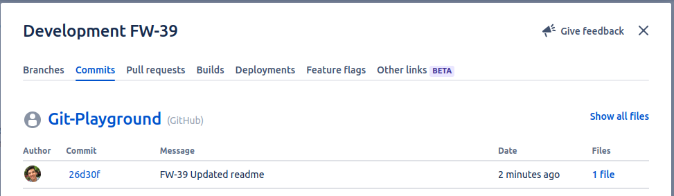
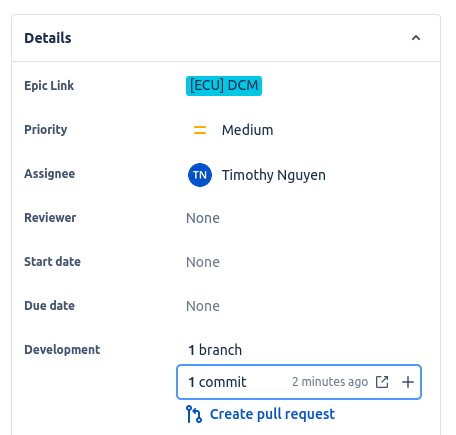

> If you forget to add the issue ID to the commit message, you can simply update the commit message by entering `git commit --amend -m "<New commit msg>"` and force-pushing the updated commit by entering `git push -f`.

11. Create a PR by pressing "Create pull request" in the issue's detail section. You can also do it manually on GitHub.

12. Verify in Jira that 1 PR is open in the Development issue field. Your issue's status should have automatically transitioned from "In Progress" to "Under Review". You should also see a comment in the activity section confirming this status transition.

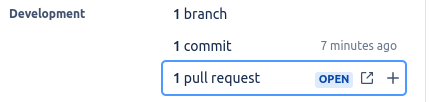
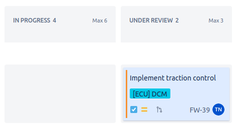
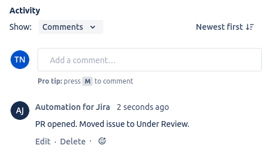

13. Merge in your PR by pressing "Merge pull request" on GitHub.

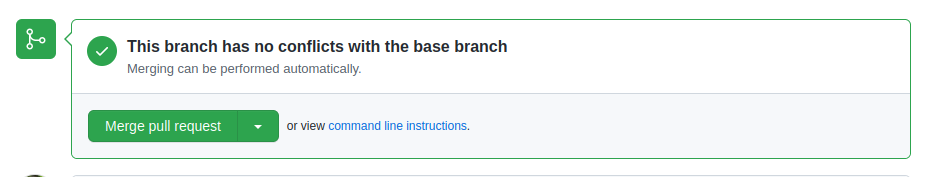

14. Verify in Jira that the 1 PR has been merged in successfully. Your issue's status should have automatically transitioned from "Under Review" to "Done". You should also see a comment in the activity section congratulating you on completing this tutorial!

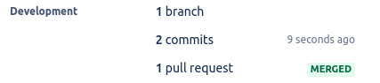
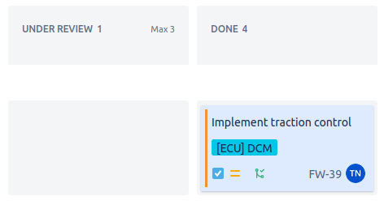
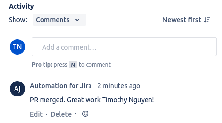

15. Optional but recommended. Clean up your remote branch and your local branch by entering the following command:`git checkout main && git push --delete origin <branch name> && git branch -D <branch name>`.

## Resources

[Atlassian - Reference Issues In Your Development Work](https://support.atlassian.com/jira-software-cloud/docs/reference-issues-in-your-development-work/)
